# 🖨️ Thermal Printer Service

<div align="center">

[](https://www.python.org/)
[](https://fastapi.tiangolo.com/)
[](https://www.docker.com/)
[](./tests/)
[](LICENSE)
[](#)

**Cashino KP-300 / KP-301H** termal yazıcılar için profesyonel REST API servisi.  
FastAPI (Python) ile geliştirilmiştir.

[📖 Türkçe](#türkçe) · [🇬🇧 English](#english) · [🇩🇪 Deutsch](#deutsch) · [🇫🇷 Français](#français)

</div>

---

## 📸 Ekran Görüntüleri / Screenshots

| Dashboard Genel Bakış | Bağlantı Paneli |
|:---:|:---:|
| 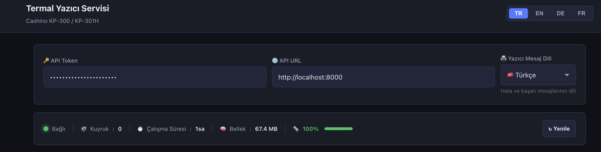 | 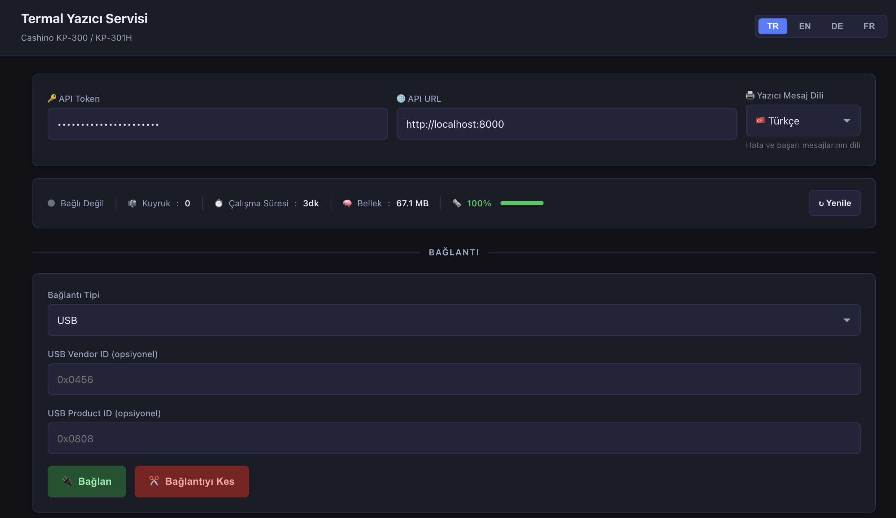 |

| Metin Yazdırma | Görsel Yazdırma |
|:---:|:---:|
| 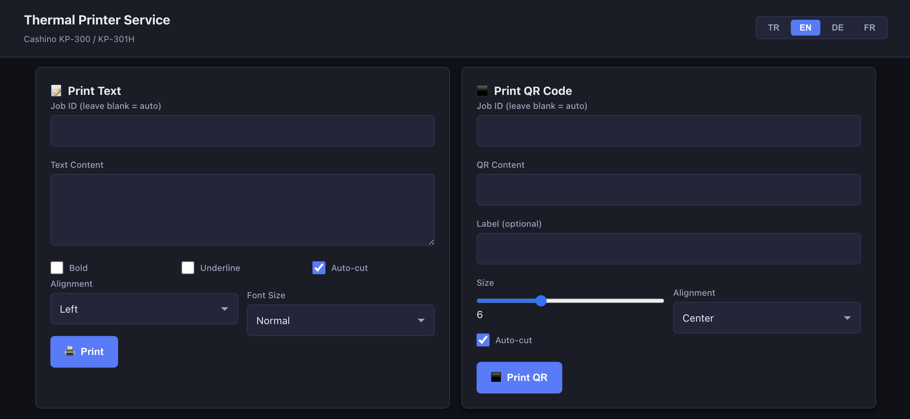 | 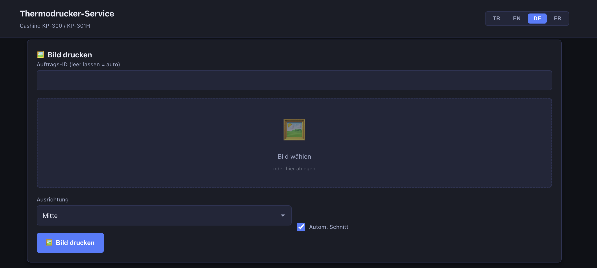 |

| ACO Recycling Fişi | Log Görüntüleyici |
|:---:|:---:|
| 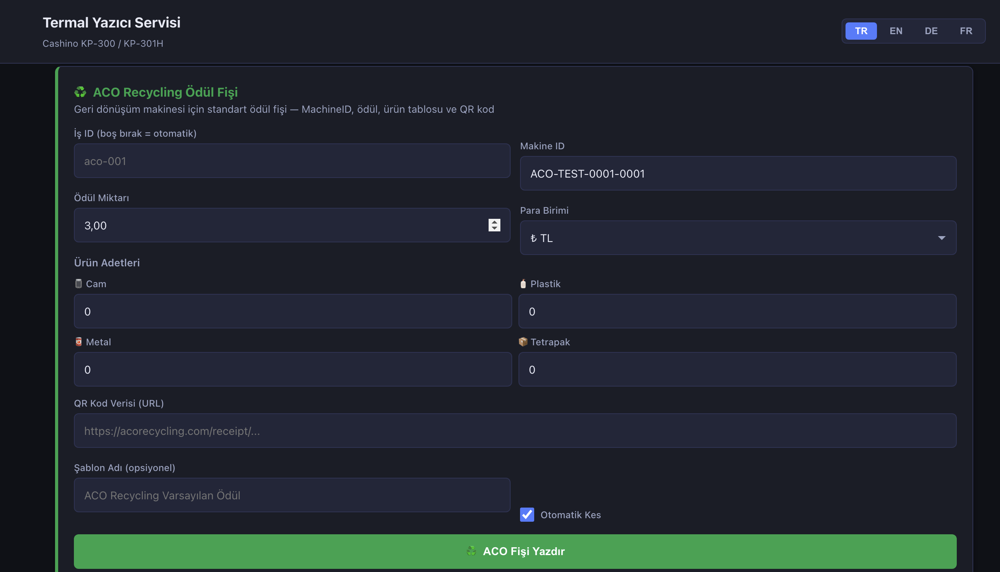 | 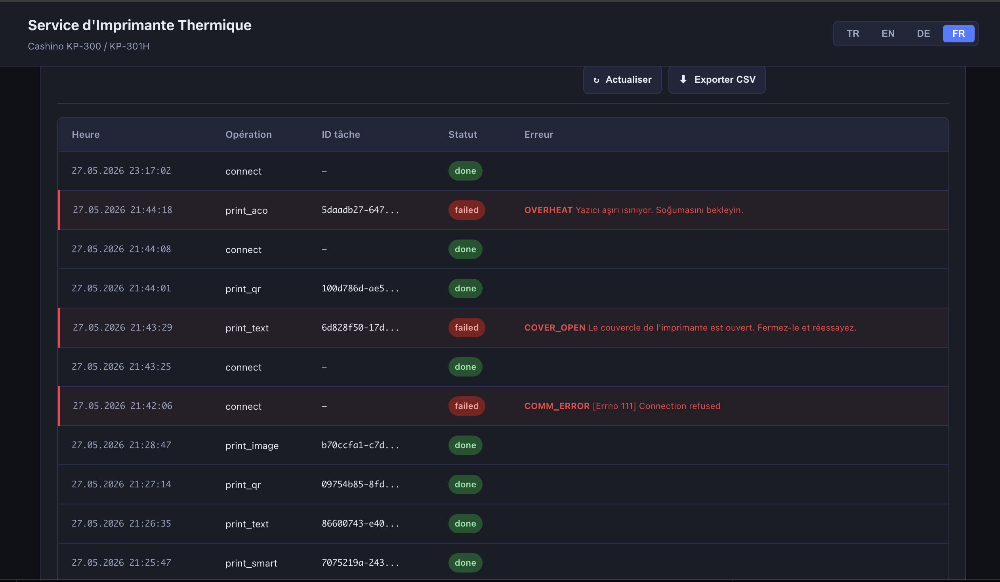 |

| Kağıt Rulo Takibi | Gerçek Fiş Çıktısı |
|:---:|:---:|
| 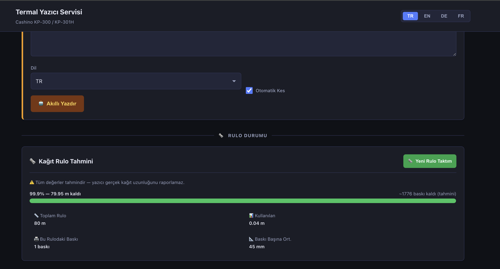 | 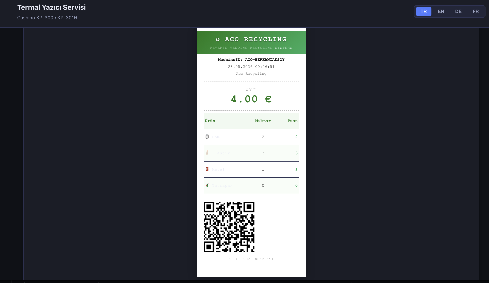 |

### 📋 Swagger API Dokümantasyonu

| | | |
|:---:|:---:|:---:|
| 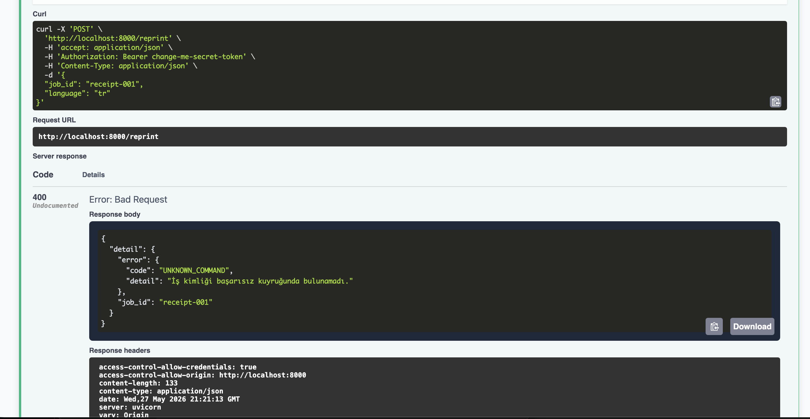 | 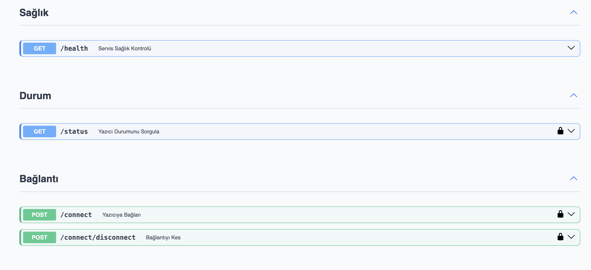 | 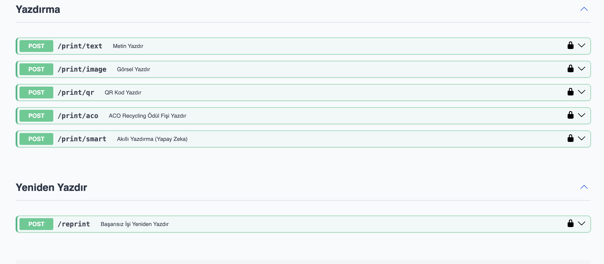 |
| 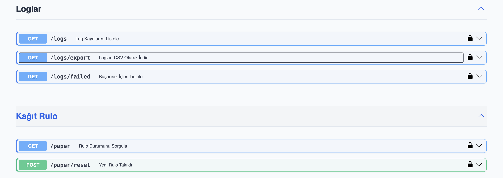 | 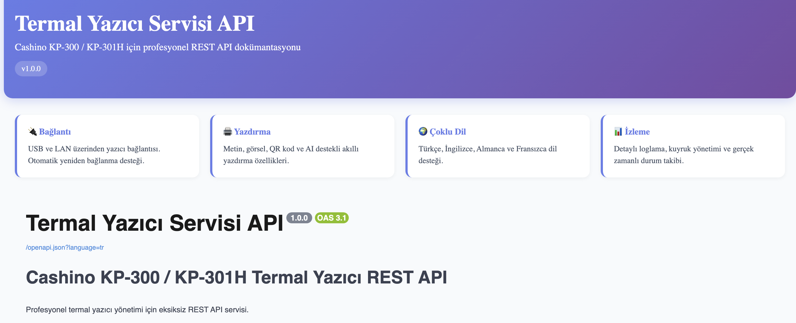 | 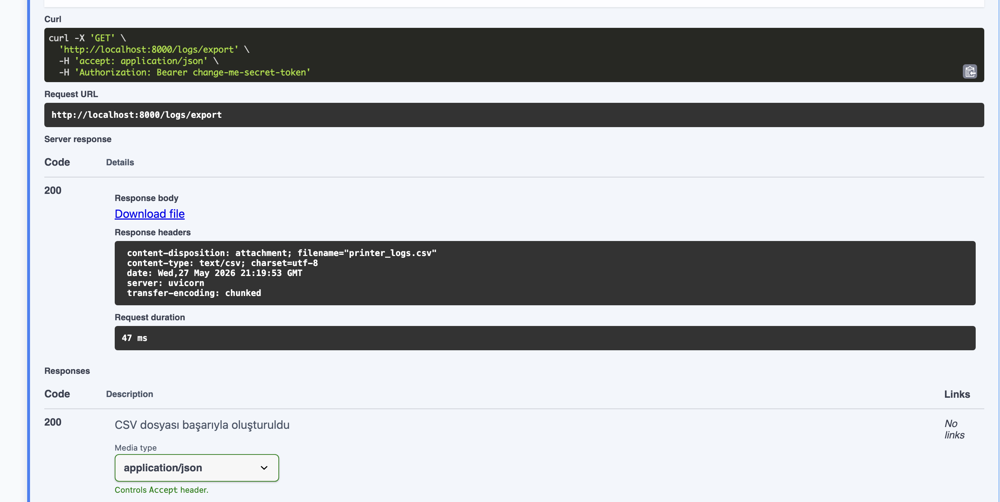 |

### 🖥️ Sahte Yazıcı Terminal

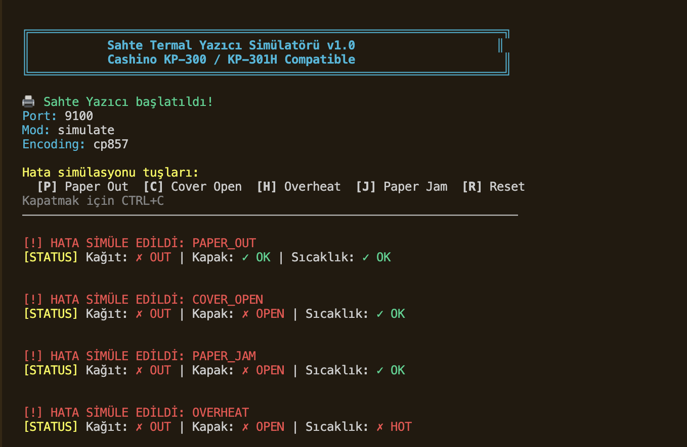

---

## 📁 Alt Klasör Dokümantasyonu

| Klasör | Açıklama | README |
|--------|----------|--------|
| [`app/`](app/) | FastAPI backend — tüm API, servisler, ESC/POS motoru | [📖 app/README.md](app/README.md) |
| [`tests/`](tests/) | 56 pytest testi — birim, entegrasyon, hata simülasyonu | [📖 tests/README.md](tests/README.md) |
| [`test_fake_printer/`](test_fake_printer/) | Donanımsız TCP yazıcı simülatörü | [📖 test_fake_printer/README.md](test_fake_printer/README.md) |
| [`ui/`](ui/) | Web dashboard — tek HTML dosyası, GitHub Pages uyumlu | [📖 ui/README.md](ui/README.md) |

---

<a id="türkçe"></a>

## 🇹🇷 Türkçe

### Özellikler

- **USB & LAN Bağlantısı** — Otomatik yeniden bağlanma (exponential backoff)
- **Tam ESC/POS Desteği** — Metin, görsel (PNG/JPEG), QR kod, kağıt kesme
- **ACO Recycling Entegrasyonu** — Geri dönüşüm makinesi ödül fişi
- **Kağıt Rulo Tahmini** — Kalan metre, baskı tahmini, düşük stok uyarısı
- **Çoklu Dil (i18n)** — TR / EN / DE / FR (API yanıtları ve Web UI)
- **Loglama** — JSON Lines format, CSV dışa aktarma, sayfalama
- **Başarısız İş Kuyruğu** — Disk kalıcılığı, yeniden baskı endpoint'i
- **Akıllı Yazdırma (LLM)** — OpenRouter ile yapay zeka destekli fiş oluşturma (opsiyonel)
- **56 Test** — Birim, entegrasyon, hata simülasyonu (fiziksel yazıcı gerektirmez)
- **Docker Ready** — `docker compose up --build` ile tek komut kurulum
- **Swagger UI** — `/docs` adresinde interaktif API dokümantasyonu

### Hızlı Başlangıç

```bash
# 1. Klonla
git clone https://github.com/berkantaksyy/thermal_printer_service.git
cd thermal_printer_service

# 2. Sanal ortam + bağımlılıklar
python -m venv venv
source venv/bin/activate        # Windows: venv\Scripts\activate
pip install -r requirements.txt

# 3. Ortam ayarları
cp .env.example .env
# .env dosyasını yazıcı ayarlarınıza göre düzenleyin

# 4. Servisi başlat
python -m uvicorn app.main:app --host 0.0.0.0 --port 8000

# 5. API Docs
open http://localhost:8000/docs

# 6. Web Dashboard
open http://localhost:8000/ui
```

### Docker

```bash
docker compose up --build -d
docker compose logs -f
docker compose down
```

USB yazıcı için `docker-compose.yml` içindeki `devices` bölümünün yorumunu kaldırın:
```yaml
devices:
  - "/dev/bus/usb:/dev/bus/usb"
privileged: true
```

### Ortam Değişkenleri

| Değişken | Varsayılan | Açıklama |
|----------|-----------|----------|
| `APP_HOST` | `0.0.0.0` | Sunucu bind adresi |
| `APP_PORT` | `8000` | Port |
| `APP_DEBUG` | `false` | Debug / hot-reload modu |
| `API_BEARER_TOKEN` | `change-me-secret-token` | **Değiştirin!** Bearer kimlik doğrulama tokeni |
| `DEFAULT_CONNECTION_TYPE` | `usb` | `usb` veya `lan` |
| `USB_VENDOR_ID` | `0x0456` | Cashino KP-300 USB vendor ID |
| `USB_PRODUCT_ID` | `0x0808` | Cashino KP-300 USB product ID |
| `LAN_HOST` | `192.168.1.100` | Yazıcı IP adresi |
| `LAN_PORT` | `9100` | Ham yazdırma portu |
| `RECONNECT_MAX_RETRIES` | `5` | Maksimum yeniden bağlanma denemesi |
| `RECONNECT_BACKOFF_BASE` | `2` | Exponential backoff tabanı (saniye) |
| `RECONNECT_BACKOFF_MAX` | `60` | Maksimum backoff gecikmesi (saniye) |
| `LOG_DIR` | `./logs` | Log dosyası dizini |
| `LOG_KEEP_DAYS` | `30` | Log tutma süresi (gün) |
| `DEFAULT_LANGUAGE` | `en` | Varsayılan dil |
| `LLM_ENABLED` | `false` | LLM özelliğini etkinleştir |
| `OPENROUTER_API_KEY` | — | OpenRouter API anahtarı (LLM etkinse) |
| `OPENROUTER_MODEL` | `mistralai/mistral-7b-instruct:free` | LLM modeli |

### API Referansı

Tüm endpoint'ler `GET /health` hariç Bearer token gerektirir:
```
Authorization: Bearer <token>
```

#### Bağlantı

| Metod | Endpoint | Açıklama |
|-------|----------|----------|
| `POST` | `/connect` | USB veya LAN bağlantısı kur |
| `POST` | `/connect/disconnect` | Bağlantıyı kes |

#### Yazdırma

| Metod | Endpoint | Açıklama |
|-------|----------|----------|
| `POST` | `/print/text` | Formatlı metin yazdır |
| `POST` | `/print/image` | Base64 PNG/JPEG görsel yazdır |
| `POST` | `/print/qr` | QR kod yazdır |
| `POST` | `/print/smart` | LLM destekli akıllı fiş (opsiyonel) |
| `POST` | `/reprint` | Başarısız işi job ID ile yeniden yazdır |

#### Durum & İzleme

| Metod | Endpoint | Auth | Açıklama |
|-------|----------|------|----------|
| `GET` | `/status` | ✅ | Yazıcı durumu, kuyruk boyutu |
| `GET` | `/health` | ❌ | Servis sağlığı (Docker health check) |
| `GET` | `/logs` | ✅ | Sayfalanmış log kayıtları |
| `GET` | `/logs/export` | ✅ | CSV olarak dışa aktar |
| `GET` | `/logs/failed` | ✅ | Başarısız iş listesi |
| `GET` | `/paper/stats` | ✅ | Kağıt rulo istatistikleri |
| `POST` | `/paper/reset` | ✅ | Yeni rulo taktım — sayacı sıfırla |

#### Örnek İstekler

```json
POST /print/text
{
  "job_id": "receipt-001",
  "lines": [
    { "text": "ACO RECYCLING", "bold": true, "align": "center", "font_size": "double" },
    { "text": "Ödül: 3.00 TL", "bold": true, "align": "center" },
    { "text": "Cam: 0  Plastik: 2  Metal: 1", "align": "left" }
  ],
  "cut": true,
  "language": "tr"
}
```

```json
POST /print/smart
{
  "data": {
    "machine_id": "ACO-TEST-0001",
    "reward": "3.00 TL",
    "plastic": 2,
    "metal": 1
  },
  "template_hint": "geri dönüşüm ödül fişi",
  "language": "tr"
}
```

### Hata Kodları

| Kod | HTTP | KP-300 LED | Açıklama |
|-----|------|-----------|----------|
| `PAPER_OUT` | 503 | 3 kez | Kağıt bitti |
| `PAPER_JAM` | 503 | 4 kez | Kağıt sıkışması |
| `COVER_OPEN` | 503 | 6 kez | Kapak açık |
| `OVERHEAT` | 503 | 5 kez | Yazıcı kafası aşırı ısındı |
| `COMM_ERROR` | 502 | — | USB/LAN haberleşme hatası |
| `UNKNOWN_COMMAND` | 400 | — | Geçersiz ESC/POS komutu |

```json
{
  "detail": {
    "error": { "code": "PAPER_OUT", "detail": "Kağıt bitti. Lütfen kağıt yükleyin." },
    "job_id": "receipt-001"
  }
}
```

### Proje Yapısı

```
thermal_printer_service/
├── app/                         # FastAPI backend
│   ├── main.py                  # Uygulama giriş noktası
│   ├── api/
│   │   ├── deps.py              # Bearer auth bağımlılığı
│   │   └── routes/              # Tüm API route'ları
│   ├── core/
│   │   ├── config.py            # pydantic-settings konfigürasyon
│   │   ├── escpos_engine.py     # ESC/POS komut oluşturucu
│   │   ├── printer.py           # Soyut temel + fabrika
│   │   ├── usb_printer.py       # USB backend (pyusb)
│   │   ├── lan_printer.py       # LAN backend (asyncio TCP)
│   │   └── error_handler.py     # Hata kodları + PrinterError
│   ├── models/                  # Pydantic istek/yanıt modelleri
│   ├── services/                # İş mantığı servisleri
│   └── i18n/                   # Backend dil dosyaları (TR/EN/DE/FR)
├── ui/                          # Web Dashboard (GitHub Pages uyumlu)
│   ├── index.html               # Tek dosya dashboard
│   ├── js/                      # Uygulama, i18n, API modülleri
│   └── i18n/                   # UI dil dosyaları (TR/EN/DE/FR)
├── tests/                       # 56 pytest testi
│   ├── conftest.py              # Fixture'lar
│   ├── mock_printer.py          # Donanımsız mock yazıcı
│   ├── test_api.py              # API endpoint testleri (17)
│   ├── test_services.py         # Servis katmanı testleri (14)
│   ├── test_escpos.py           # ESC/POS birim testleri (10)
│   └── test_mock_printer_errors.py  # Hata simülasyon testleri (15)
├── test_fake_printer/           # TCP tabanlı sahte yazıcı simülatörü
│   └── fake_printer.py
├── docs/screenshots/            # README için ekran görüntüleri
├── data/failed_jobs/            # Başarısız iş kalıcılığı (gitignore)
├── logs/                        # Çalışma zamanı logları (gitignore)
├── Dockerfile
├── docker-compose.yml
├── requirements.txt
├── pytest.ini
└── .env.example
```

### Testler

```bash
# Tüm testler (fiziksel yazıcı gerekmez)
pytest -v

# Kapsamlı çalıştır
pytest --cov=app --cov-report=html

# Sahte yazıcı ile entegrasyon testi
cd test_fake_printer && python3 fake_printer.py --mode parse
# Yeni terminalde:
python -m uvicorn app.main:app --host 0.0.0.0 --port 8000
```

Detaylı test dokümantasyonu: [tests/README.md](tests/README.md)

### Yazıcı Donanım Notları

- **Cashino KP-300**: 80mm kağıt, 203dpi, 250mm/s, USB Type B + RJ45 + RS232
- **Cashino KP-301H**: 25-83mm ayarlanabilir kağıt, 203dpi, 250mm/s
- **USB ID'ler**: VID `0x0456`, PID `0x0808` — farklıysa `.env` ile ayarlayın (`lsusb` ile kontrol edin)
- **LAN Portu**: `9100` (ham yazdırma standart portu)
- **Görsel genişliği**: 80mm model için maksimum 576px raster genişlik

#### LED Hata Göstergesi (KP-301H)

| Yanıp Sönme | Hata |
|-------------|------|
| 2 | Yazıcı kafası bağlı değil |
| 3 | Kağıt yok (PAPER_OUT) |
| 4 | Kesici hatası (PAPER_JAM) |
| 5 | Aşırı ısınma (OVERHEAT) |
| 6 | Platen açık (COVER_OPEN) |

---

<a id="english"></a>

<details>
<summary>🇬🇧 English — Click to expand</summary>

## English

### Features

- **USB & LAN Connection** — Auto-reconnect with exponential backoff
- **Full ESC/POS Support** — Text, images (PNG/JPEG), QR codes, paper cut
- **ACO Recycling Integration** — Reward receipt for recycling machines
- **Paper Roll Estimation** — Remaining meters, print count, low-stock warning
- **Multi-language (i18n)** — TR / EN / DE / FR (API responses and Web UI)
- **Logging** — JSON Lines format, CSV export, pagination
- **Failed Job Queue** — Disk persistence, reprint endpoint
- **Smart Print (LLM)** — AI-assisted receipt generation via OpenRouter (optional)
- **56 Tests** — Unit, integration, error simulation (no physical printer required)
- **Docker Ready** — Single-command setup with `docker compose up --build`
- **Swagger UI** — Interactive API documentation at `/docs`

### Quick Start

```bash
git clone https://github.com/berkantaksyy/thermal_printer_service.git
cd thermal_printer_service
python -m venv venv
source venv/bin/activate
pip install -r requirements.txt
cp .env.example .env
python -m uvicorn app.main:app --host 0.0.0.0 --port 8000
```

Open API docs: `http://localhost:8000/docs`  
Open Dashboard: `http://localhost:8000/ui`

### API Endpoints

All endpoints require Bearer token except `GET /health`:
```
Authorization: Bearer <your-token>
```

| Method | Endpoint | Description |
|--------|----------|-------------|
| `POST` | `/connect` | Connect to printer (USB/LAN) |
| `POST` | `/connect/disconnect` | Disconnect |
| `POST` | `/print/text` | Print formatted text |
| `POST` | `/print/image` | Print base64 PNG/JPEG |
| `POST` | `/print/qr` | Print QR code |
| `POST` | `/print/smart` | LLM-assisted receipt (optional) |
| `POST` | `/reprint` | Retry a failed job by ID |
| `GET` | `/status` | Printer status + queue size |
| `GET` | `/health` | Service health (no auth) |
| `GET` | `/logs` | Paginated log entries |
| `GET` | `/logs/export` | Download logs as CSV |
| `GET` | `/logs/failed` | List failed jobs |
| `GET` | `/paper/stats` | Paper roll statistics |
| `POST` | `/paper/reset` | Reset paper roll counter |

### Error Codes

| Code | HTTP | Description |
|------|------|-------------|
| `PAPER_OUT` | 503 | Paper roll empty |
| `PAPER_JAM` | 503 | Paper jam in cutter |
| `COVER_OPEN` | 503 | Printer cover open |
| `OVERHEAT` | 503 | Print head overheating |
| `COMM_ERROR` | 502 | USB/LAN communication failure |
| `UNKNOWN_COMMAND` | 400 | Invalid ESC/POS command |

### Running Tests

```bash
pytest -v                           # All 56 tests
pytest --cov=app --cov-report=html  # With coverage report
pytest tests/test_api.py            # API tests only
```

See [tests/README.md](tests/README.md) for full test documentation.

</details>

---

<a id="deutsch"></a>

<details>
<summary>🇩🇪 Deutsch — Klicken zum Aufklappen</summary>

## Deutsch

### Funktionen

- **USB & LAN-Verbindung** — Automatische Wiederverbindung mit exponentiellem Backoff
- **Vollständige ESC/POS-Unterstützung** — Text, Bilder (PNG/JPEG), QR-Codes, Papierschnitt
- **ACO Recycling-Integration** — Bonbeleg für Recyclingautomaten
- **Papierrollenüberwachung** — Verbleibende Meter, Druckanzahl, Niedrigbestandswarnung
- **Mehrsprachig (i18n)** — TR / EN / DE / FR (API-Antworten und Web-UI)
- **Protokollierung** — JSON-Lines-Format, CSV-Export, Paginierung
- **Fehlgeschlagene Jobs** — Festplattenpersistenz, Nachdrucken-Endpunkt
- **Intelligenter Druck (LLM)** — KI-gestützte Bonbelegstellung via OpenRouter (optional)
- **56 Tests** — Unit-, Integrations- und Fehlersimulation (kein physischer Drucker erforderlich)
- **Docker Ready** — Einzel-Befehl-Setup mit `docker compose up --build`

### Schnellstart

```bash
git clone https://github.com/berkantaksyy/thermal_printer_service.git
cd thermal_printer_service
python -m venv venv
source venv/bin/activate
pip install -r requirements.txt
cp .env.example .env
python -m uvicorn app.main:app --host 0.0.0.0 --port 8000
```

API-Dokumentation: `http://localhost:8000/docs`  
Web-Dashboard: `http://localhost:8000/ui`

### API-Endpunkte

Alle Endpunkte außer `GET /health` benötigen einen Bearer-Token:
```
Authorization: Bearer <ihr-token>
```

| Methode | Endpunkt | Beschreibung |
|---------|----------|--------------|
| `POST` | `/connect` | Drucker verbinden (USB/LAN) |
| `POST` | `/connect/disconnect` | Verbindung trennen |
| `POST` | `/print/text` | Formatierten Text drucken |
| `POST` | `/print/image` | Base64 PNG/JPEG drucken |
| `POST` | `/print/qr` | QR-Code drucken |
| `POST` | `/print/smart` | KI-gestützter Bon (optional) |
| `POST` | `/reprint` | Fehlgeschlagenen Job wiederholen |
| `GET` | `/status` | Druckerstatus + Warteschlangengröße |
| `GET` | `/health` | Servicestatus (keine Auth) |
| `GET` | `/logs` | Paginierte Protokolleinträge |
| `GET` | `/logs/export` | Protokolle als CSV herunterladen |
| `GET` | `/paper/stats` | Papierrollenstatistiken |

### Tests ausführen

```bash
pytest -v
pytest --cov=app --cov-report=html
```

</details>

---

<a id="français"></a>

<details>
<summary>🇫🇷 Français — Cliquer pour développer</summary>

## Français

### Fonctionnalités

- **Connexion USB & LAN** — Reconnexion automatique avec backoff exponentiel
- **Support ESC/POS complet** — Texte, images (PNG/JPEG), QR codes, coupe-papier
- **Intégration ACO Recycling** — Reçu de récompense pour machines de recyclage
- **Suivi du rouleau papier** — Mètres restants, comptage d'impressions, alerte stock faible
- **Multi-langues (i18n)** — TR / EN / DE / FR (réponses API et interface Web)
- **Journalisation** — Format JSON Lines, export CSV, pagination
- **File d'attente des échecs** — Persistance sur disque, endpoint de réimpression
- **Impression intelligente (LLM)** — Génération de reçus assistée par IA via OpenRouter (optionnel)
- **56 Tests** — Unitaires, intégration, simulation d'erreurs (sans imprimante physique)
- **Docker Ready** — Configuration en une commande avec `docker compose up --build`

### Démarrage rapide

```bash
git clone https://github.com/berkantaksyy/thermal_printer_service.git
cd thermal_printer_service
python -m venv venv
source venv/bin/activate
pip install -r requirements.txt
cp .env.example .env
python -m uvicorn app.main:app --host 0.0.0.0 --port 8000
```

Documentation API: `http://localhost:8000/docs`  
Tableau de bord Web: `http://localhost:8000/ui`

### Points de terminaison API

Tous les endpoints nécessitent un token Bearer sauf `GET /health`:
```
Authorization: Bearer <votre-token>
```

| Méthode | Endpoint | Description |
|---------|----------|-------------|
| `POST` | `/connect` | Connecter l'imprimante (USB/LAN) |
| `POST` | `/connect/disconnect` | Déconnecter |
| `POST` | `/print/text` | Imprimer du texte formaté |
| `POST` | `/print/image` | Imprimer PNG/JPEG en base64 |
| `POST` | `/print/qr` | Imprimer un QR code |
| `POST` | `/print/smart` | Reçu assisté par IA (optionnel) |
| `POST` | `/reprint` | Réessayer un job échoué par ID |
| `GET` | `/status` | Statut imprimante + taille file |
| `GET` | `/health` | Santé du service (sans auth) |
| `GET` | `/logs` | Entrées de journal paginées |
| `GET` | `/logs/export` | Télécharger les journaux en CSV |
| `GET` | `/paper/stats` | Statistiques du rouleau de papier |

### Exécuter les tests

```bash
pytest -v
pytest --cov=app --cov-report=html
```

</details>

---

## 📄 Lisans / License

MIT License — kişisel ve ticari kullanım için ücretsiz / free for personal and commercial use.
